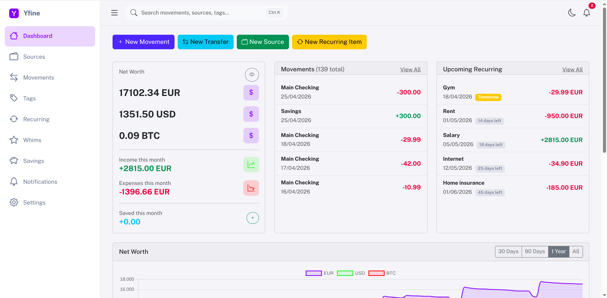
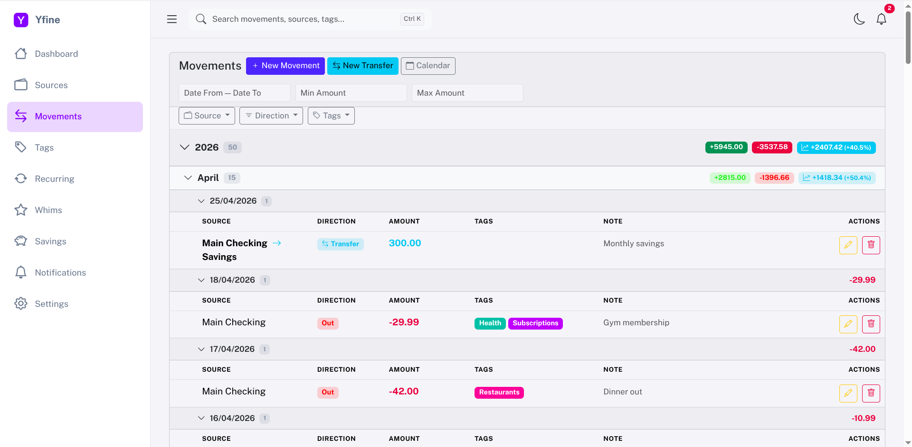
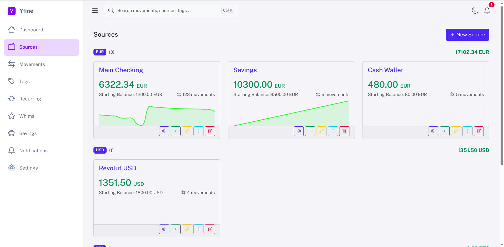
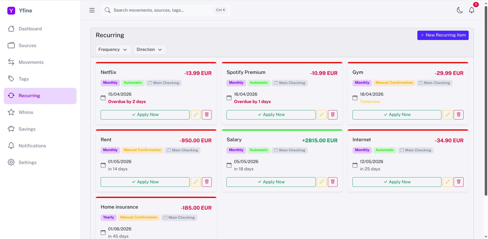
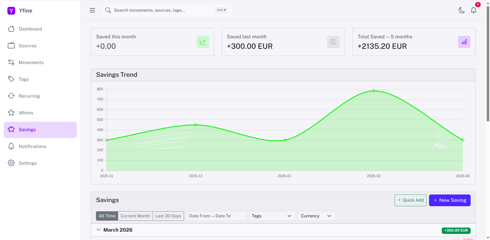
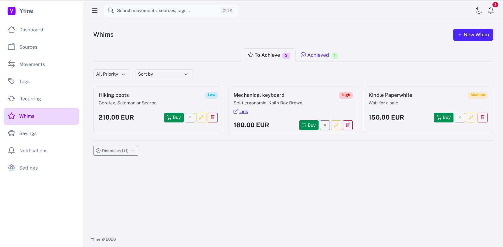
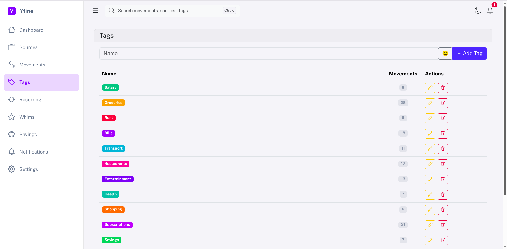
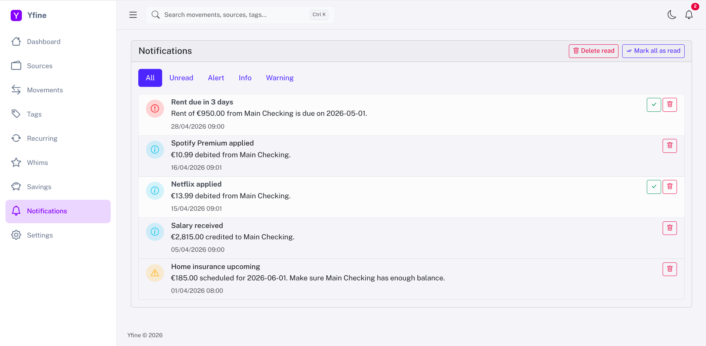

# Yfine

## ⚠️ WARNING

The app is still in early development and evolving quickly. I’m doing my best to ship updates without breaking the database or existing features, but some issues are to be expected.

If you need support or want to contribute, feel free to join the discussions on GitHub, open an issue, or submit a PR.

Another known issue is related to the executables built in the releases which might not always work on all platforms or configurations. If you encounter any problems running the desktop app, please report them so I can investigate and provide fixes, building from source is recommended in the meantime.

Stay tuned! A stable release is coming soon!
---

A personal finance app that runs on your own machine. Tracks multiple wallets, records movements (with attachments for receipts), handles recurring payments, keeps a real savings fund, plans goals, and manages a wishlist. FastAPI backend, SQLite database, Jinja templates: no cloud, no accounts, no telemetry.

Works in the browser or as a standalone desktop window (PyInstaller + pywebview). UI in English, Italian, Spanish, and Ukrainian (more to come).

## Screenshots

| | |
|---|---|
|  |  |
| **Dashboard** — net worth, monthly flow, balance history | **Movements** — grouped by year/month/day with filters |
|  |  |
| **Sources** — multi-currency wallets | **Recurring** — bills, subscriptions, salary |
|  |  |
| **Savings** — tracked over time | **Whims** — prioritised wishlist |
|  |  |
| **Tags** — custom colours | **Notifications** — alerts, confirmations, warnings |

## Install

Requires Python 3.11+.

```bash
git clone https://github.com/AlexDevFlow/Yfine.git
cd Yfine
python3 -m venv .venv
source .venv/bin/activate
pip install -r requirements.txt
uvicorn main:app --reload --port 8000
```

Open http://localhost:8000. The database is created on first run, with a handful of default tags.

### Docker

```bash
docker compose up -d
```

Data lives in the `yfine-data` volume mounted at `/data`, so it survives container restarts and image rebuilds.

### Desktop app

```bash
pip install pywebview pyinstaller
pyinstaller yfine.spec
# bundle in dist/yfine/
```

Prebuilt binaries for Linux, macOS, and Windows are produced by GitHub Actions on tag push (`v*`), or on demand via `workflow_dispatch`.

Desktop data lives in the platform's app dir:

| Platform | Location |
|---|---|
| Linux | `~/.local/share/yfine/` |
| macOS | `~/Library/Application Support/yfine/` |
| Windows | `%APPDATA%\yfine\` |

## How it works

**Sources** are wallets — bank accounts, cash, crypto — each with its own ISO 4217 currency and a starting balance. The current balance is computed by summing the movements linked to the source.

**Movements** are in/out transactions against a source, optionally tagged and with a note. Transfers between two sources are just a pair of linked movements created in one step.

**Recurring items** are bills or incomes on a schedule (daily/weekly/monthly/yearly). They can apply automatically when due or wait for manual confirmation; the scheduler polls hourly and pushes notifications for upcoming dates and insufficient balances.

**Savings** are real transfers into a per-currency **Savings Fund** — an automatic source that actually holds your money rather than just logging "I saved X". You pick which account the money comes from, Yfine moves it, the fund's balance grows. Net worth is **conserved**: the source you picked drops by the same amount the fund grows. The fund behaves like any other source: it shows up in transfers, movements, and (optionally) in the Sources page. Upgrading from an older Yfine that stored savings as a pure log? The first time you open the Savings page a one-shot wizard lets you pick which account the historical entries came from, so conservation holds there too.

**Goals** are savings targets with an optional deadline. You allocate money toward a goal over time from any account; each allocation is a real transfer into the goal's accumulating source. Closing a goal refunds its balance in a single transfer; deleting one auto-reverses every allocation back to its origin. A goal can also be linked to a **whim** — clicking "Save for this" on a wishlist item creates a goal tied to it, and when you eventually purchase the whim the accumulated money is used automatically.

**Whims** are a priority-sorted wishlist. You can save up for them (linked goal + progress bar on the card), buy them straight from a source, or dismiss.

**Attachments**: every movement can carry up to 5 files (PNG/JPEG/WebP/HEIC/PDF, 10 MB each). Handy for receipts, invoices, or warranty scans. Files live on disk next to the database and ride along in full `.yfine` archive exports.

The dashboard aggregates net worth per currency (mixed currencies are shown side by side, never auto-converted), plus monthly in vs out, year-over-year, and balance history per source.

**Global search** runs across movements (including amounts — type `45.50` and it matches), sources, tags, savings, goals, whims, and recurring items, with keyboard navigation (↑↓ Enter Esc, Ctrl/⌘-K to focus).

Data exports to JSON, xlsx, or PDF, and reimports from JSON. The full `.yfine` archive format also bundles attachment files.

Everything else — language, theme, date format, LAN access, port — lives under Settings inside the app. FastAPI's interactive API docs are at `/docs`.

## Security

Passwords are optional. When you set one, the SQLite file is encrypted at rest with AES-256-GCM (key derived via PBKDF2) and decrypted after login. On shutdown the plaintext copy is wiped. Archives written by older versions with Fernet are still readable and get transparently re-encrypted as AES-256-GCM on the next shutdown.

Auth config — password hash, salt, session secret, port, locale — is stored in a JSON file *outside* the encrypted database, so the app can still boot and prompt for the password.

LAN access is off by default. Turning it on binds to `0.0.0.0` with a self-signed TLS cert generated at startup.

## Plugins

Plugins add routes, models, templates, and static assets. Install them from ZIP through the UI or drop a directory into `plugins/installed/`.

Minimal layout:

```
my_plugin/
├── manifest.json            # id, name, version
├── routes.py                # FastAPI router
├── models.py                # SQLModel tables (auto-prefixed)
├── services.py
├── templates/my_plugin/     # namespaced
├── static/my_plugin/        # namespaced
└── locales/
```

Every plugin is statically scanned (AST) before installation. Native or compiled extensions are rejected, plugin management endpoints are localhost-only, and the uncompressed size is capped at 200 MB.

The scanner is a safety net, not a sandbox. **Review plugin source before installing anything from an author you don't trust.**

## Architecture

```
Router (HTTP) → Service (business logic) → SQLModel session
```

Routers only parse requests and return responses. Everything else — balance calculation, transfer linking, notifications — sits in `services/`. One router per domain, with JSON endpoints under `/api/*` and HTML pages without prefix.

Schema changes go through Alembic. Migrations run on startup, and a timestamped backup is written next to the database before each run.

To add one:

```bash
alembic revision --autogenerate -m "short description"
alembic upgrade head
```

## License

GPLv3, see [LICENSE](LICENSE).
